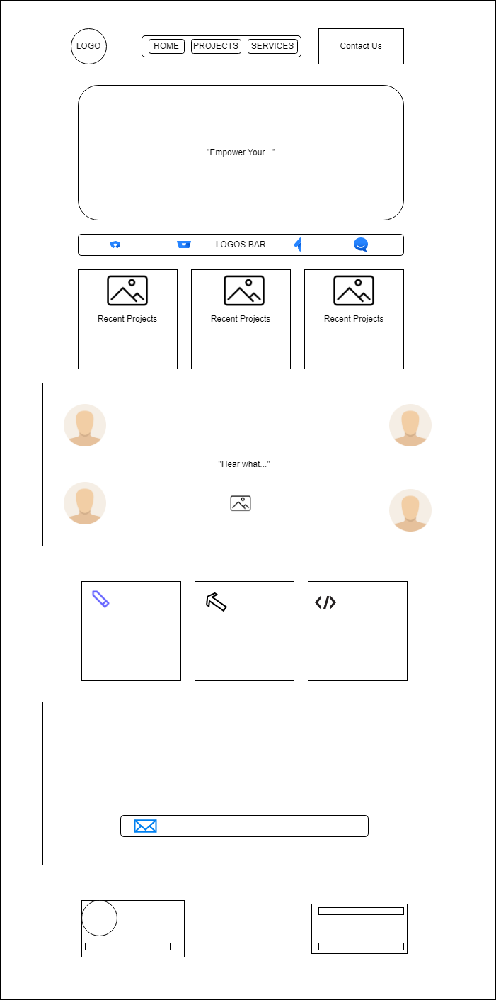
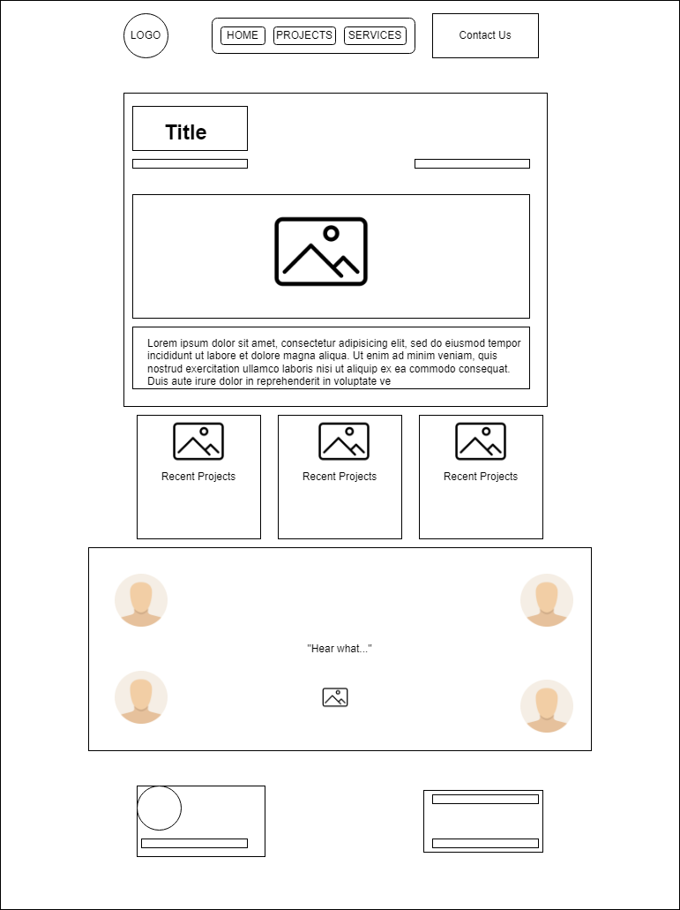
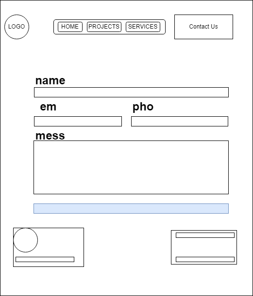
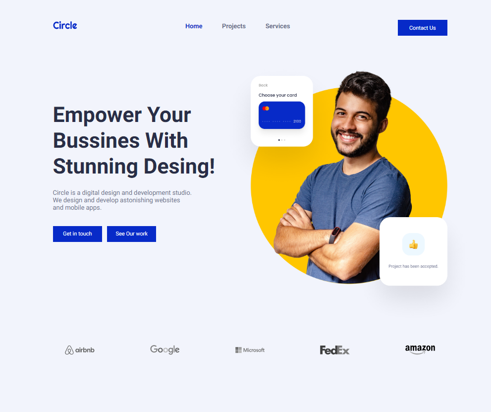
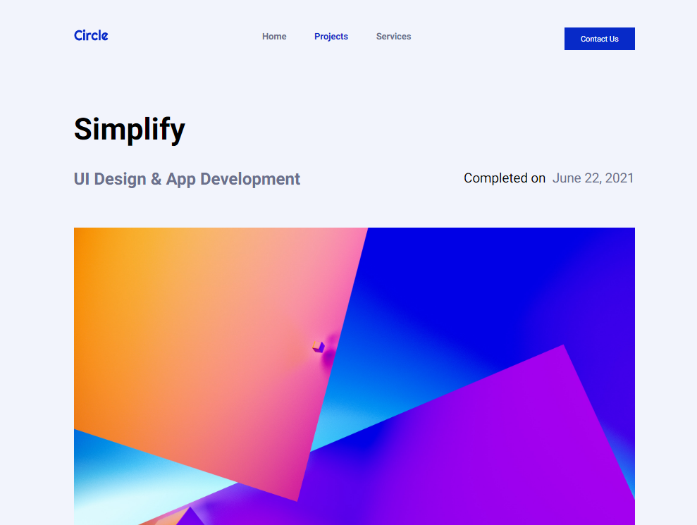
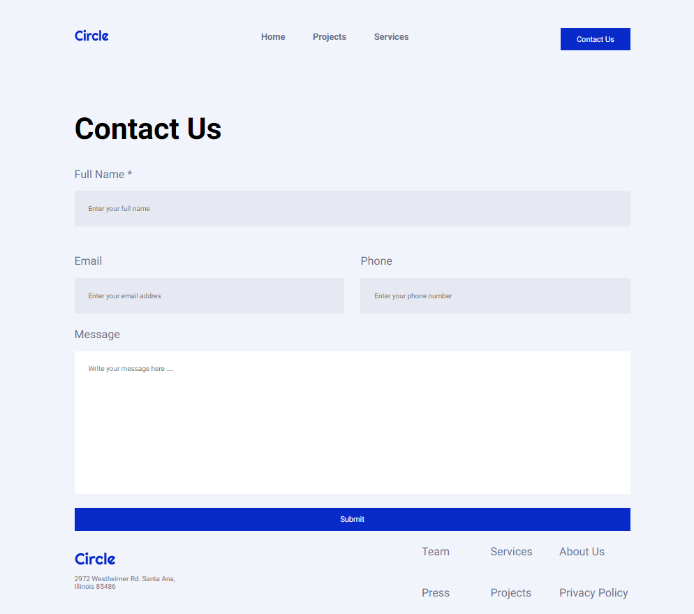

# Circle project

This project offers a nice and responsive design for a web development services studio.

## Wireframes:

### homepage

### project page

### contact page

## Technologies:

This project is made with three technologies: 
### -HTML
### -CSS 
### -JavaScript.

## Pages Structure:

### -Homepage
### -Project Page
### -Contact Page

## Components:

### -Nav-bar
### -Main section/Project Info.
### -Logos-bar
### -Card Section with 3 cards.
### -Email banner / Contact Form
### -Footer

## Screenshots

### Homepage: Navbar, Main Section & Logos Bar

### Project Page: Navbar & Project Info.

### Contact Page: Navbar, Contact Form & Footer

## Proyect Link

<a href="https://circlebypol.netlify.app/pages/homepage.html" target="_blank">Circle Page By Pablo Orozco</a>

## Feature Work

### - Add a new page with Video content.
### - Add a new page with team pics & presentations 

## Resources 

### - Ironhack Student Portal
### - Figma
### - MDN Web Docs 
### - W3SCHOOLS
### - StackOverflow

## Team Members:

### Junior Developer: Pablo Orozco.
### Teacher Assistant: Shaun Reilly.
### Teacher in Lead: Raymond Maroun.

